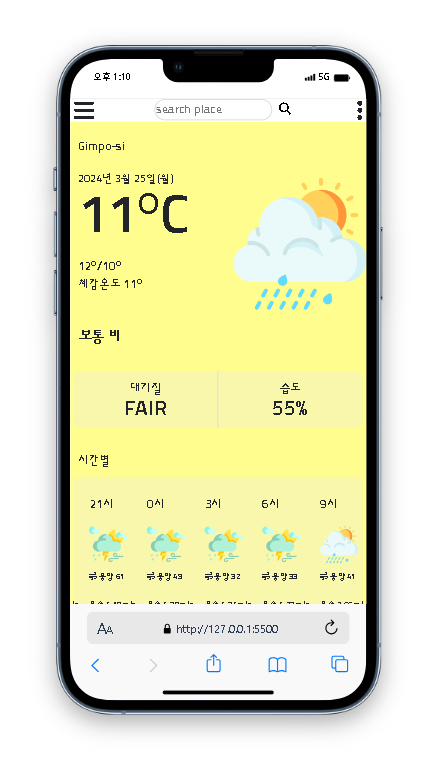
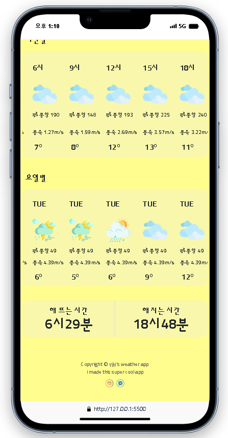

# :sunny: weather app project :cloud:
### :globe_with_meridians:language:globe_with_meridians:
- HTML5
- css3
- javascript
- jquery
- bootstrap

### :computer: 실행화면 :computer:
  
 

### :clipboard: 설명 :clipboard:
openweathermap에서 가져온 api로 지역별 날씨정보를 받아와서 적용한 앱으로, 모바일용으로 만들어졌기 때문에 손가락으로 옆으로 넘기기위해 <u>slick</u>을 사용했습니다.

원하는 지역으로 검색하면 해당지역 현재 날씨정보와 요일별, 시간별 날씨정보를 얻을 수 있습니다.

### :pushpin: 코드링크 
- [KingYJJY 깃허브](https://github.com/kingyjjy/weather-app "https:github.com/kingyjjy/weather-app")

---