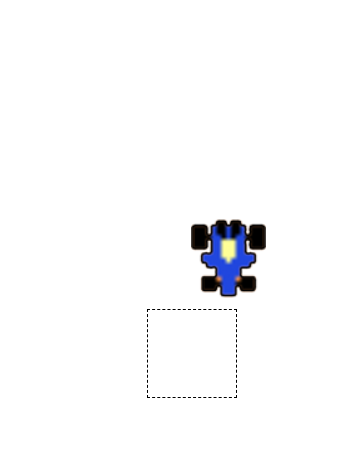

### 📌 코드링크 
  [KingYJJY 깃허브](https://github.com/kingyjjy/gascargame "https://github.com/kingyjjy/gascargame")  
  
  

### 🌍language🌎
  
   
   
    

  

### 📋 설명 📋
 **주요기능** : javascript로 키보드키를 이용해 움직이게 만들었습니다.

    html5와 javascript를 활용한 간단한 게임입니다.

    상하좌우 키보드키로 gascar를 움직여 네모로된 주차공간에 차를 주차시키는 게임입니다.

  

### 💻 실행화면 💻
  

---