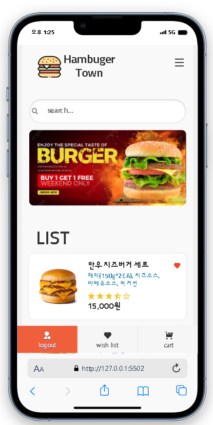
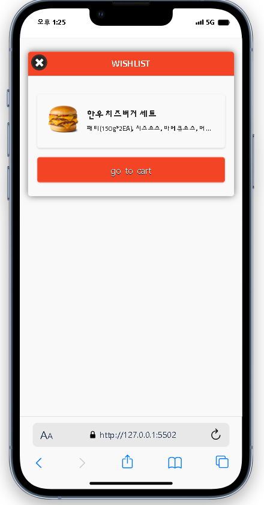

### 📌 코드링크 
  [KingYJJY 깃허브](https://github.com/kingyjjy/hamburger-app "https://github.com/kingyjjy/hamburger-app")

  

### 🌍language🌎
   
   
   
  
    

  

### 📋 설명 📋
 **주요기능** : 로그인기능, map돌리기, 메뉴선택시 가격 반영기능, 장바구니,위시리스트 기능이있습니다.

    모바일 앱으로, 원하는 햄버거 담기, 위시리스트에 넣기를 할 수 있습니다.

    모바일 app, 로그인후(testID : admin, PW : 1234) app에 들어가면
    json파일로 뿌린 menu들이 있어 원하는 menu를 클릭하면 추가메뉴를 고를 수 있고,
    추가메뉴 선택시 가격을 그에 맞게 바뀌게 만들었습니다. 

    희망 메뉴를 고르면 장바구니 혹은 위시리스트에 담을 수 있습니다.

    추가메뉴 넘길때 slick사용

  

### 💻 실행화면 💻
  
 
 

---