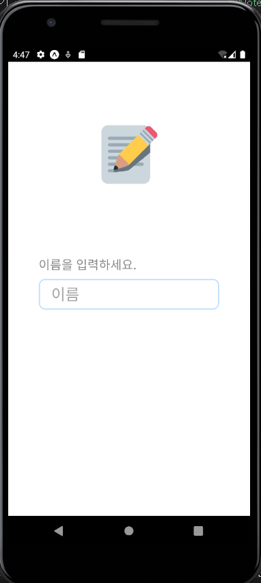
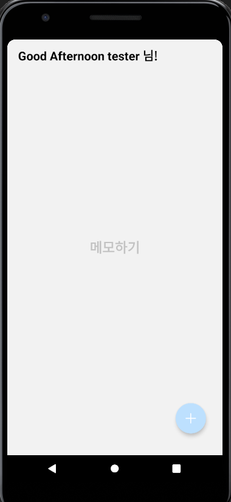
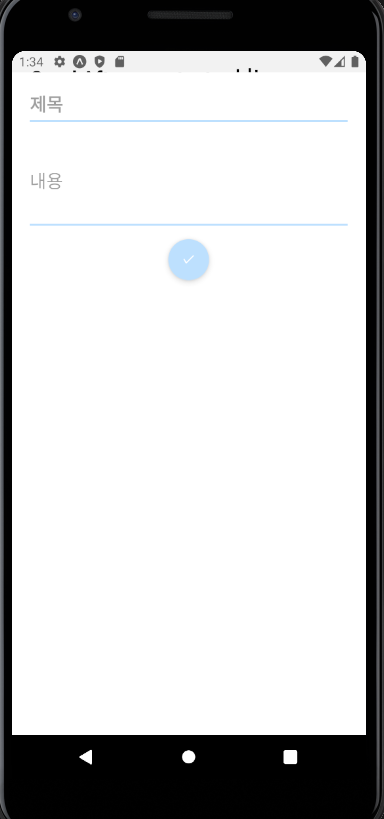
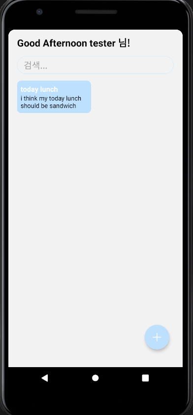
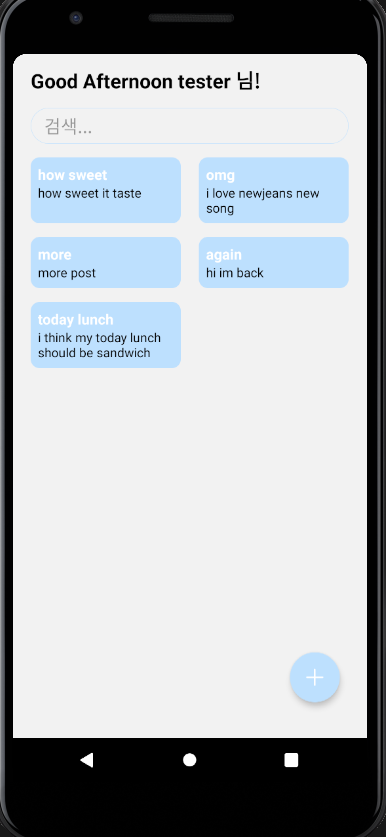
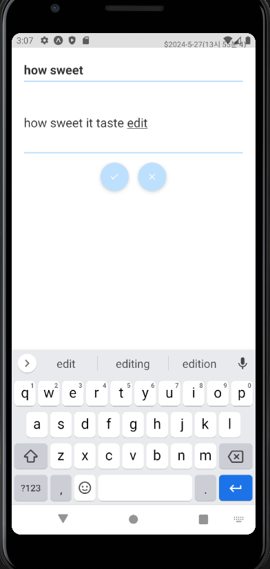
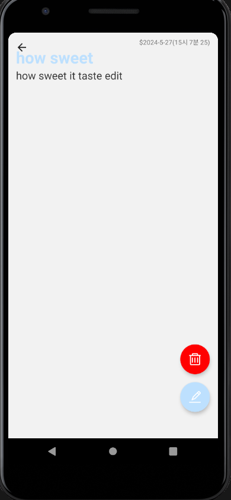

### 📌 코드링크 
 [KingYJJY 깃허브](https://github.com/kingyjjy/memoapp "https://github.com/kingyjjy/memoapp")

  

### 🌍language🌎

   
   
  
     
   

    
  
### 📋 설명 📋
 **주요기능** : 메모 crud기능

    reactnative로 만는 메모 app입니다.

    이름을 입력해 app에 들어가면, crud가 가능한 메모 어플입니다.

  

### 💻 실행화면 💻
  
  
  
  
  
  
  
  

---