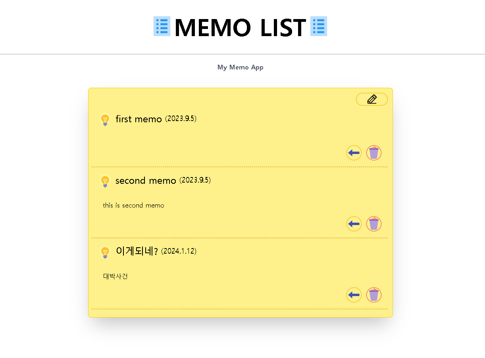
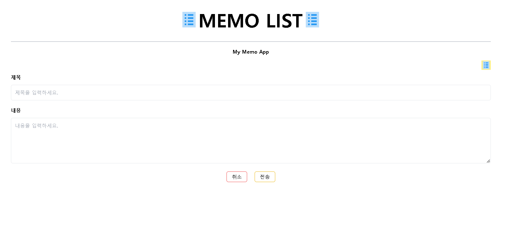

# 📒 memo app project 📝
### 🌍language🌎
- nextjs
- react
- bootstrap
- css3
- mongodb
  

### 💻 실행화면 💻
  
 
 

### 📋 설명 📋

memo webpage이고, mogodb와 연결되어 crud가 가능한 사이트 입니다.

### 📌 코드링크 
- [KingYJJY 깃허브](https://github.com/kingyjjy/mymemo-web "https://github.com/kingyjjy/mymemo-web")

---