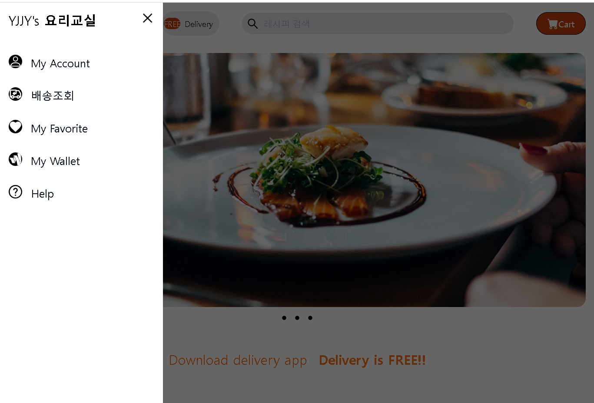

# 🍛 recipe site project 🍜
### 🌍language🌎
- tailwindcss
- javascript

### 💻 실행화면 💻
  

### 📋 설명 📋

react와 TailwindCss 기반으로 만든 반응형 web page로 레시피를 js파일에 넣으면 
카테고리별로 구분해 확인 할 수 있습니다.

점보트론 파트는 <u>splide</u>활용.

### 📌 코드링크  
- [KingYJJY 깃허브](https://github.com/kingyjjy/recipe_project/tree/main/client "https://github.com/kingyjjy/recipe_project/tree/main/client")

---