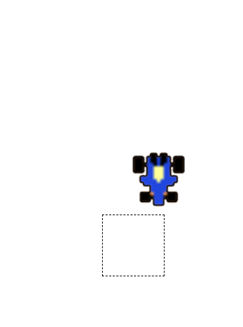

# :blue_car: gascar game project :car:
### :globe_with_meridians:language:globe_with_meridians:
- html5
- css3
- javascript
- jquery

### :computer: 실행화면 :computer:
  

### :clipboard: 설명 :clipboard:

상하좌우 키보드로 gascar를 움직여 네모로된 주차공간에 차를 주차시키는 게임입니다.

### :pushpin: 코드링크 
- [KingYJJY 깃허브](https://github.com/kingyjjy/gascargame "https://github.com/kingyjjy/gascargame")

---