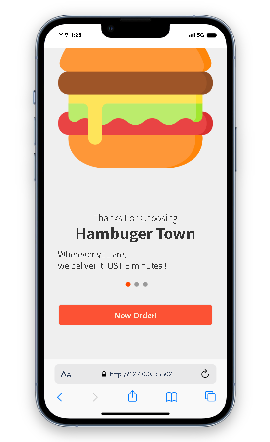
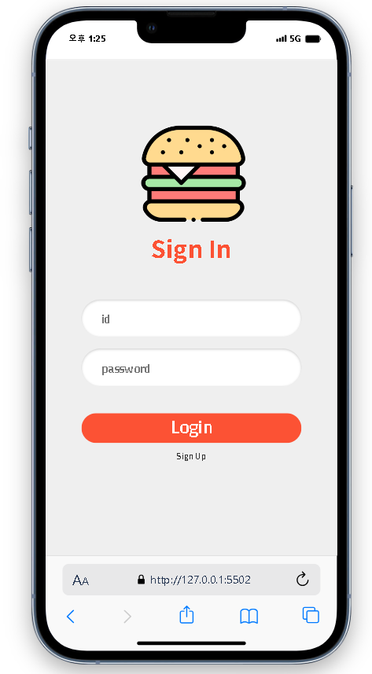
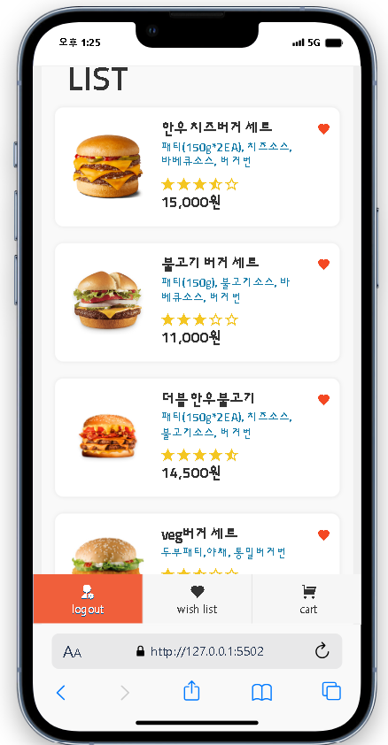
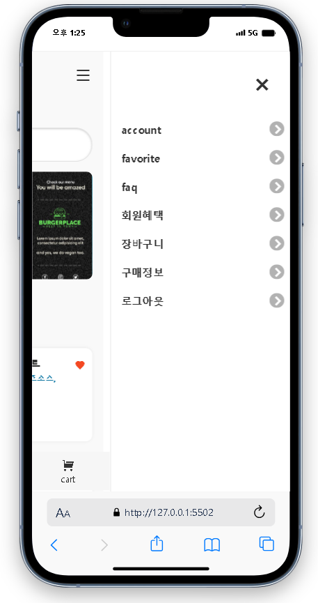
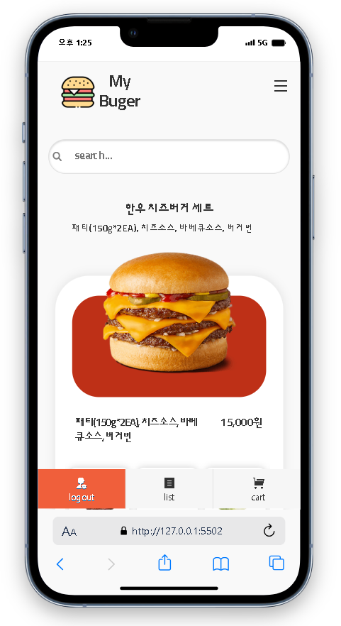
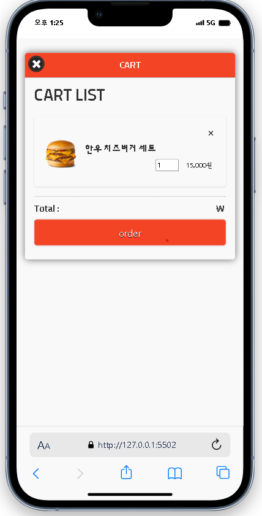

# :hamburger: hamburger app project :fries:
### :globe_with_meridians:language:globe_with_meridians:
- html5
- css3
- bootstrap
- javascript
- jquery

### :computer: 실행화면 :computer:
  
 
 

### :clipboard: 설명 :clipboard:

모바일 app, 로그인후(testID:admin, pass:1234) app에 들어가면
json파일로 뿌린 menu들이 있어 원하는 menu를 클릭하면 추가메뉴를 고를 수 있고,
추가메뉴 선택시 가격을 그에 맞게 바뀌게 만들었습니다. 

희망 메뉴를 고르면 장바구니 혹은 위시리스트에 담을 수 있습니다.

추가메뉴 넘길때 <u>slick</u>사용

### :pushpin: 코드링크 
- [KingYJJY 깃허브](https://github.com/kingyjjy/hamburger-app "https://github.com/kingyjjy/hamburger-app")

---