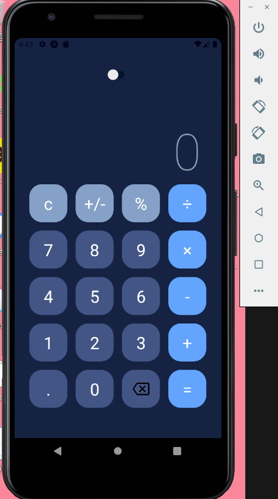
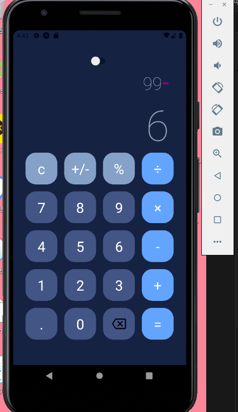
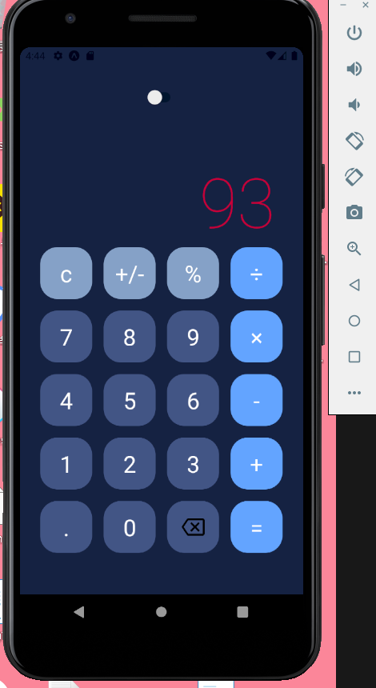

# 📱 calculator project ➗
### 🌍language🌎
- css3
- reactnative
- stylesheet
- expo
  

### 💻 실행화면 💻
  
  
  
  

### 📋 설명 📋

reactnative로 만든 계산기 어플입니다.
stylesheet를 사용해 css를 디자인 했습니다.

### 📌 코드링크 
- [KingYJJY 깃허브](https://github.com/kingyjjy/calcultor-app "https://github.com/kingyjjy/calcultor-app")

---