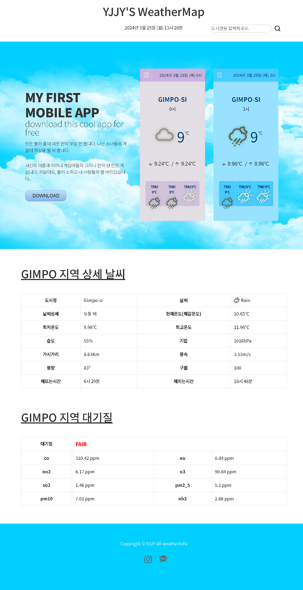

### 📌 코드링크 
   [KingYJJY 깃허브](https://github.com/kingyjjy/weather-web "https://github.com/kingyjjy/weather-web")  
  
  
  
### 🌍language🌎
   
   
   
  
    

  

### 📋 설명 📋
 **주요기능** : 지역별 날씨정보 확인 가능

    openweathermap에서 가져온 api로 지역별 날씨정보를 받아와서 적용한 web page로,
    점보트론 파트에는 모바일 앱이 있다면 이런식이다를 표현한 부분이고,
    밑으로는 지역별 상세 날씨정보와 대기질 정보를 얻을 수 있습니다.

    날씨 앱과 같이 모바일 파트에는 slick을 사용했습니다.  

  

### 💻 실행화면 💻
  

---