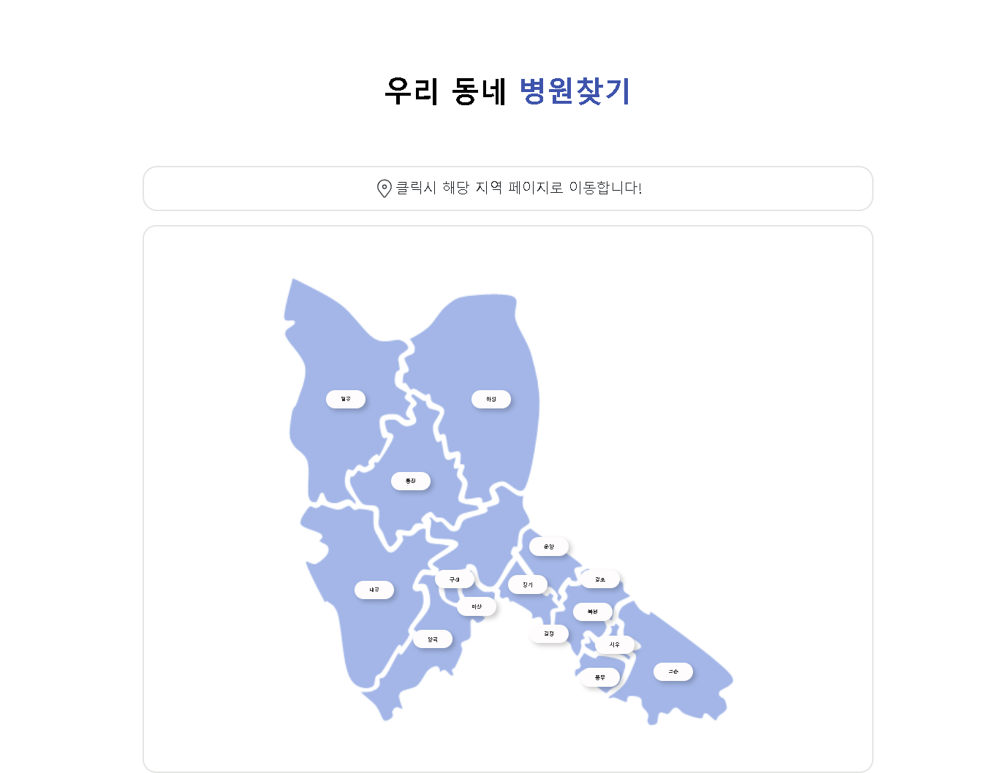
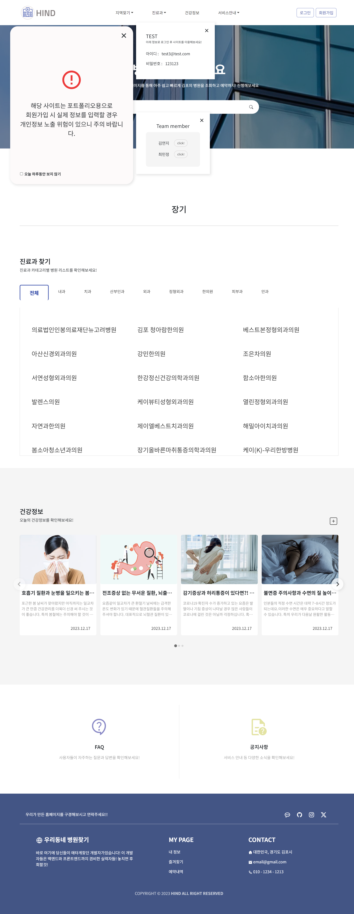
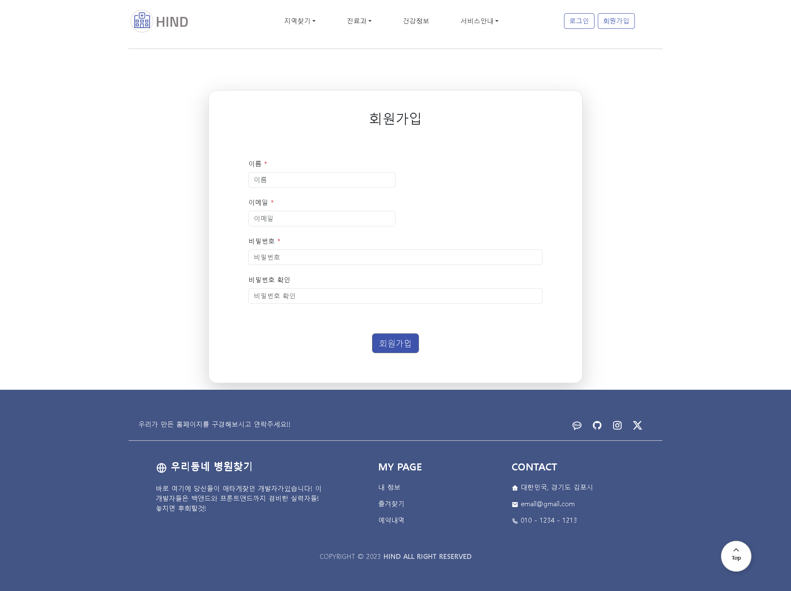
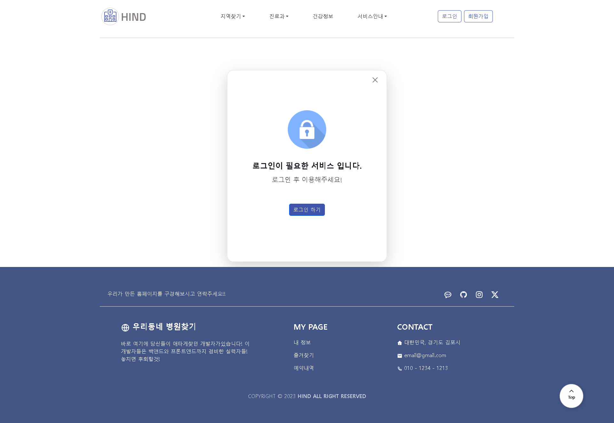
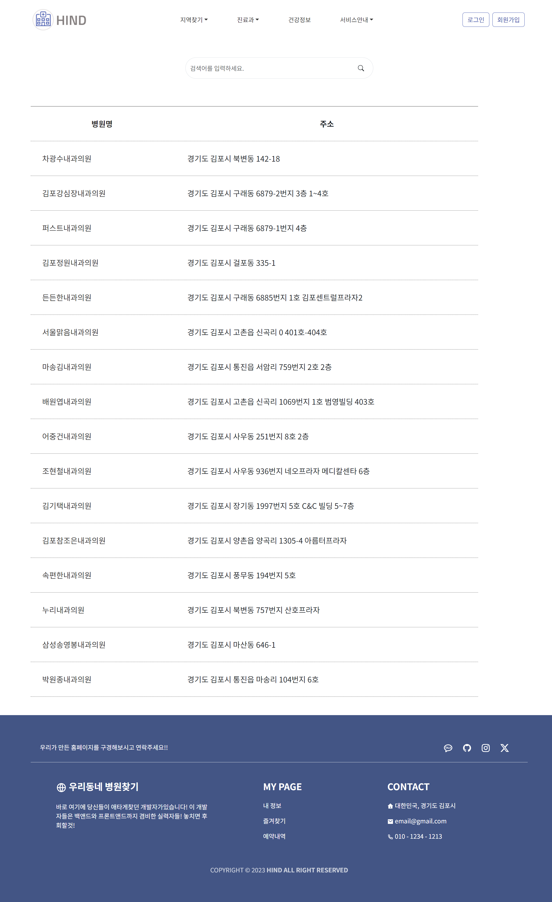
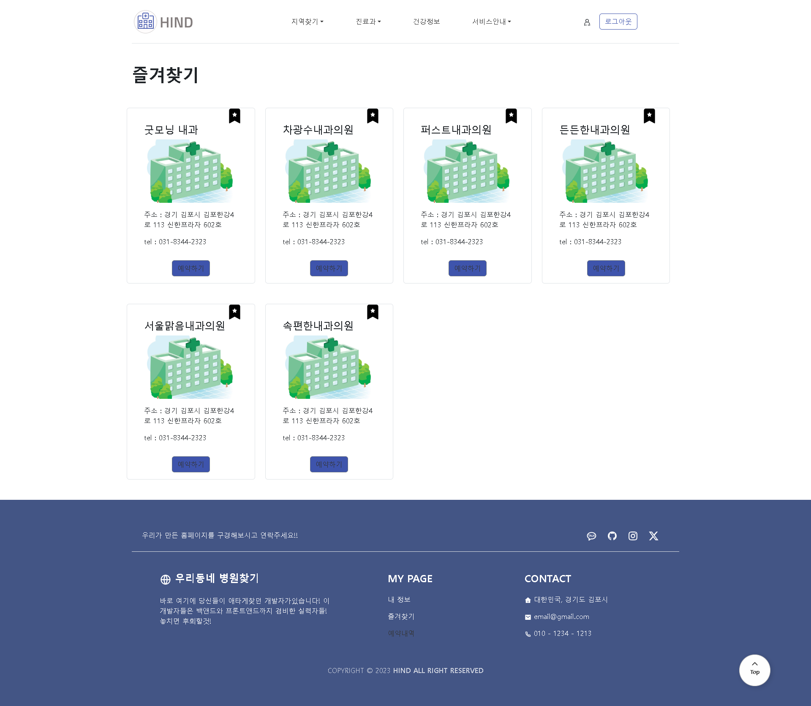
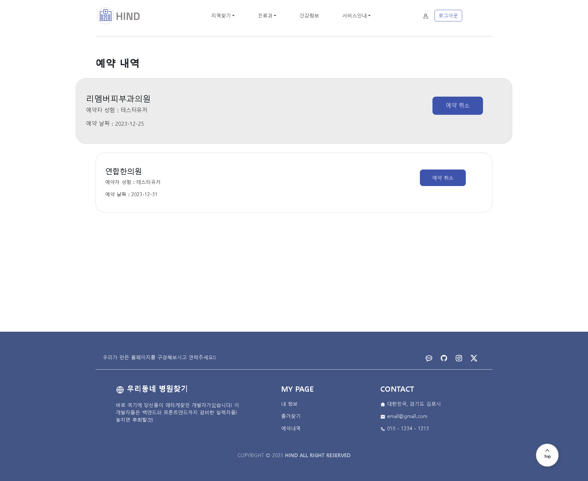
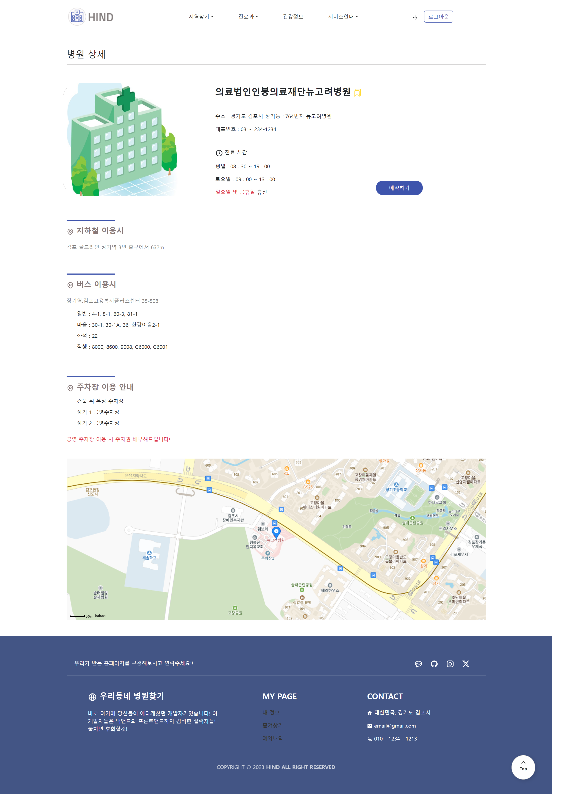
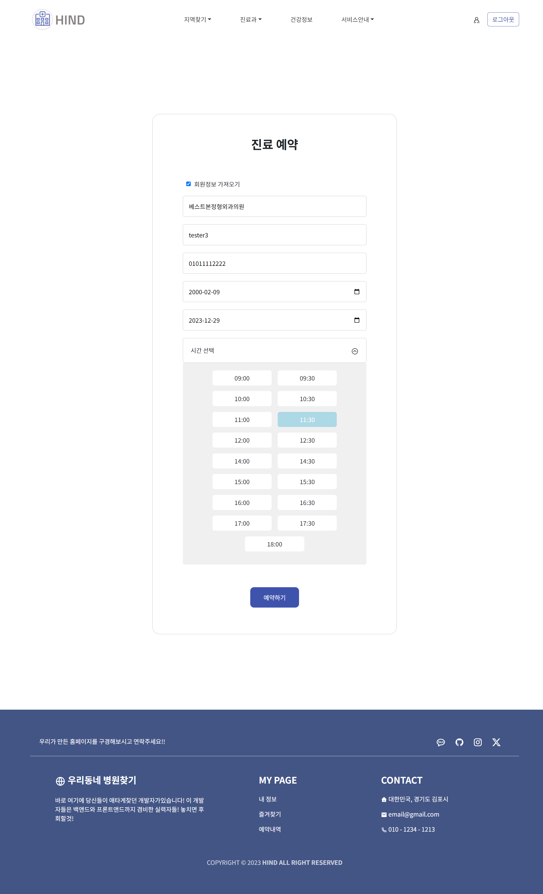

### 📌 코드링크 
 [KingYJJY 깃허브](https://github.com/kingyjjy/HIND "https://github.com/kingyjjy/HIND")

 [HIND 사이트](https://hospitalweb-f4342.web.app "https://hospitalweb-f4342.web.app")

  

# 🚑 HIND project 🏥
### 🌍language🌎
  

   
   
  
   
  
    
  
### 📋 설명 📋
 **주요기능** : firebase를 통한 로그인,회원가입기능, 희망동네병원 찾기, 병원예약, 회원정보수정, 병원검색기능

    react를 이용해 만든 병원찾기앱입니다.

    firebase를 사용해 로그인 회원가입, 구글로그인 페이스북로그인, 깃허브로그인이 가능하게 만들었고,

    예약내역, 회원정보수정 카테고리를 firebase database를 사용해 예약과 정보수정이 가능하게 만들었습니다.

    경기도 김포 소재시 병원들을 검색하기위해 경기도 open api를 사용해 김포시의 병원 정보를 얻어와서
    검색 희망 동을 클릭하면 그곳의 병원정보를 카테고리화 해서 검색해볼 수 있습니다.

    기본 검색은 회원이 아니여도 가능하지만 sidenav이용과 병원예약은 회원에게만 제공되는 서비스 입니다.

  

### 💻 실행화면 💻
  
  
  
  
  
 
     
  
 
 
 
 

---