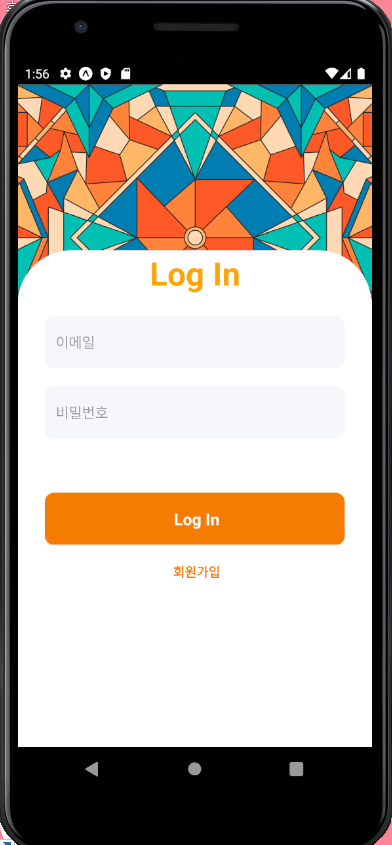
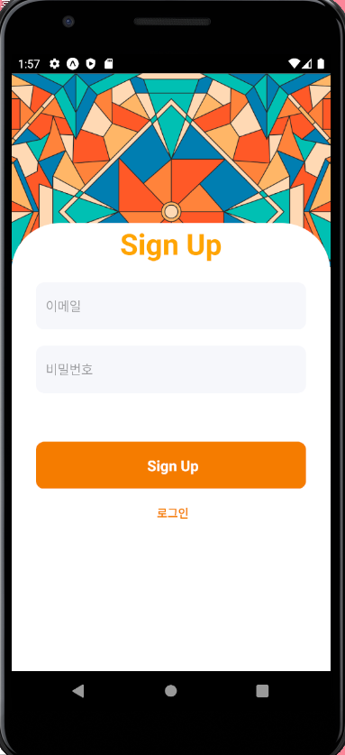
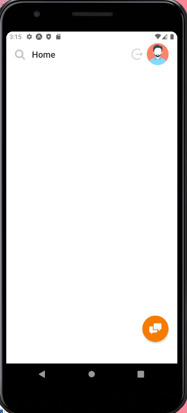
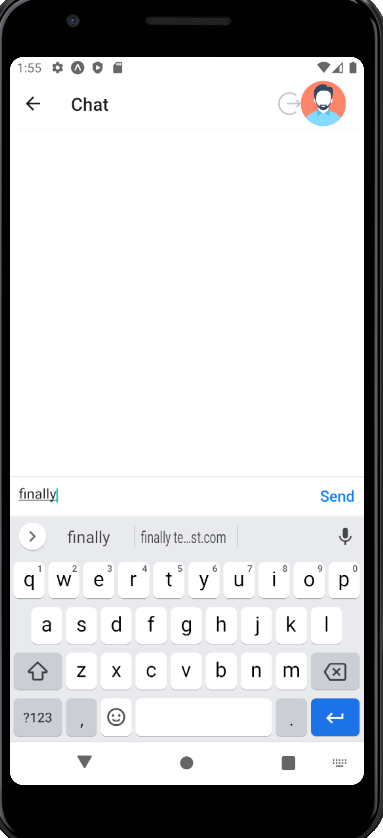
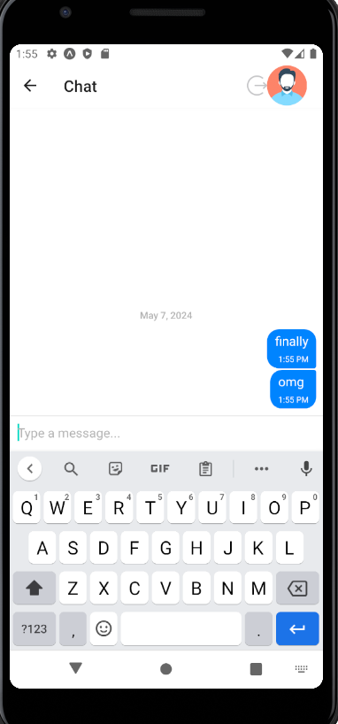

# 📩 chat app project 📱
### 🌍language🌎
- expo
- react-native
- firebase
- css3
  

### 💻 실행화면 💻
  
  
  

     

### 📋 설명 📋

giftedchat을 이용해 만든 나와 채팅하기 기능만 있는 채팅앱입니다.  
expo와 reactnative로 만들었고
database와 회원가입,로그인은 firebase를 사용했습니다. 
회원가입을 한 후 로그인을 하면 나와의 채팅이 가능합니다. 
test ID : test@test.com  PW : 123123

### 📌 코드링크 
- [KingYJJY 깃허브](https://github.com/kingyjjy/chatapp-with-firebase/tree/main "https://github.com/kingyjjy/chatapp-with-firebase/tree/main")

---