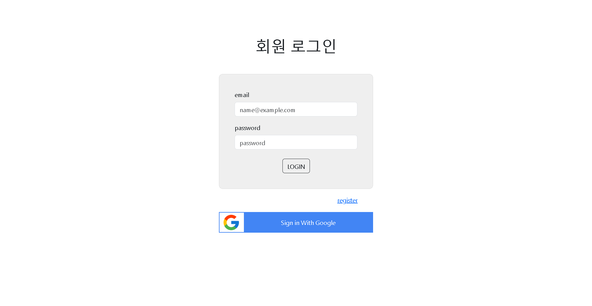
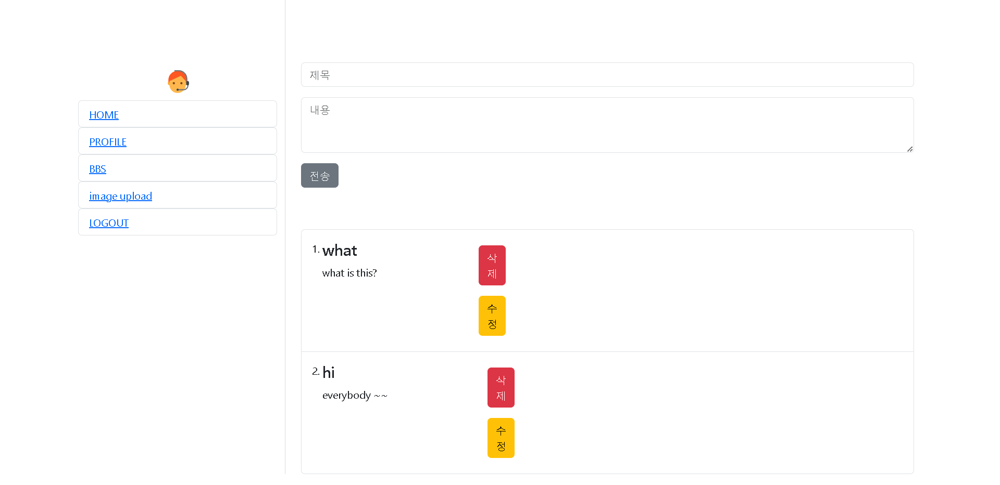
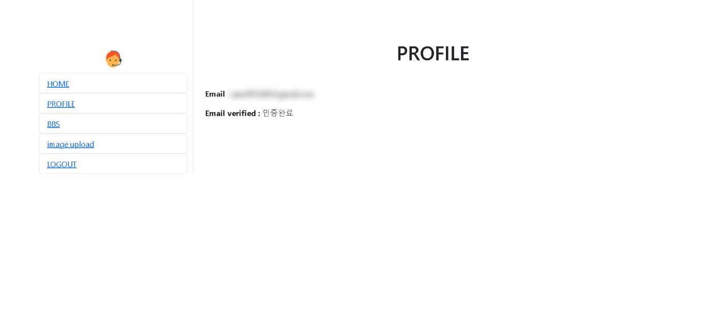

### 📌 코드링크 
 [KingYJJY 깃허브](https://github.com/kingyjjy/myhomepage "https://github.com/kingyjjy/myhomepage")
  
  

### 🌍language🌎

    

   
   
   
  
  

### 📋 설명 📋
 **주요기능** : firebase를 통한 로그인,회원가입기능, crud기능 이미지 업로드기능 

    react와 firebase를 이용해 만든 홈페이지입니다.

    회원가입을하면 이메일 인증을 할 수 있고, 박명록처럼 글을 게시하고, 수정, 삭제를 할 수 있습니다

    이미지업로드도 가능합니다.

  

### 💻 실행화면 💻
  
  
  
  

---