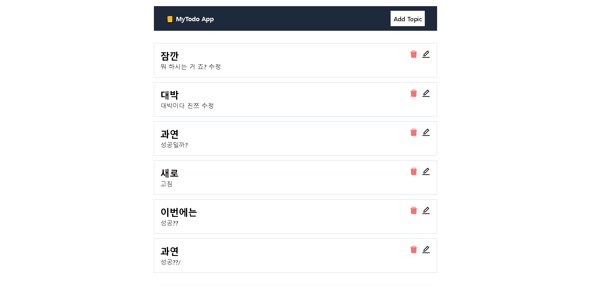
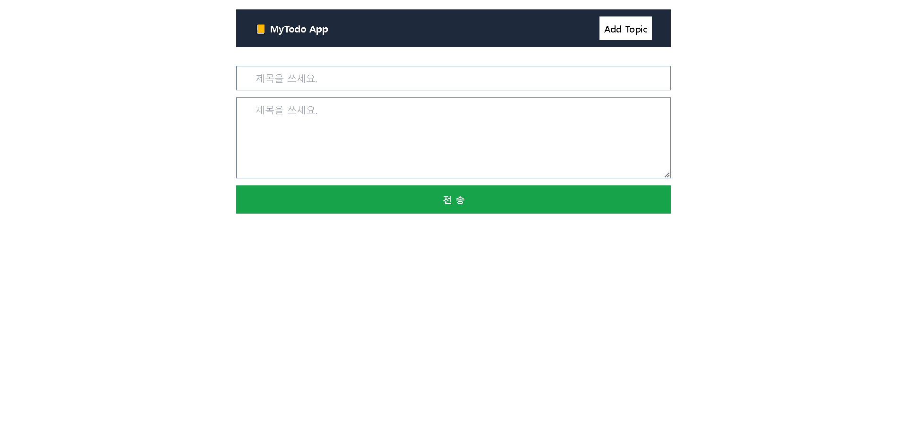

### 📌 코드링크 
 [KingYJJY 깃허브](https://github.com/kingyjjy/todo-web "https://github.com/kingyjjy/todo-web")
  
  

# 📒 todo list project 📝
### 🌍language🌎
  
   
 
   

  
  
### 📋 설명 📋
 **주요기능** : mongodb를 통한 crud기능

    nextjs와 mongodb를 이용해 만든 todolist입니다.

    mongodb를 이용해 crud가 가능합니다.

    디자인은 tailwind를 사용해 만들었습니다.

  

### 💻 실행화면 💻
  
  
  
 

---