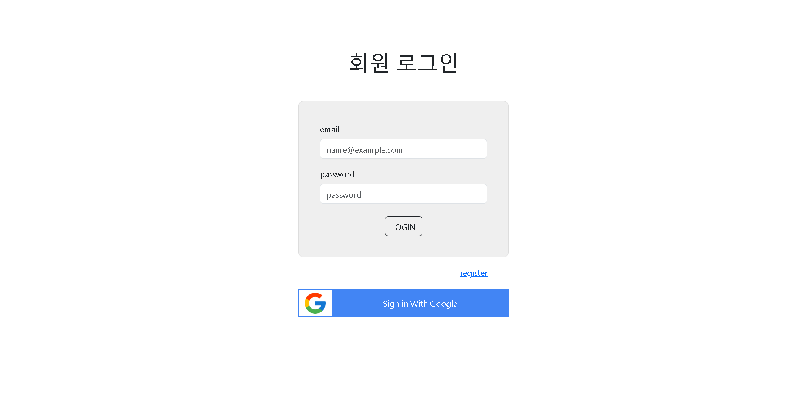
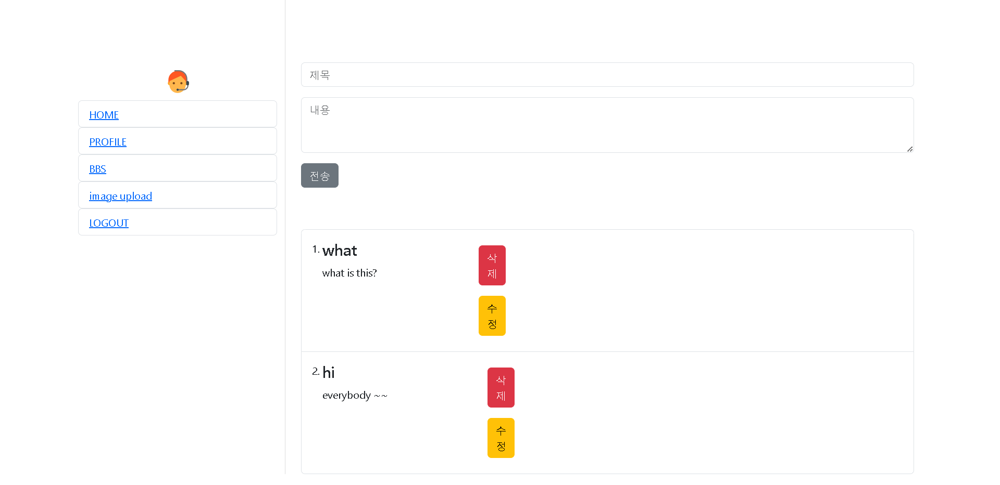
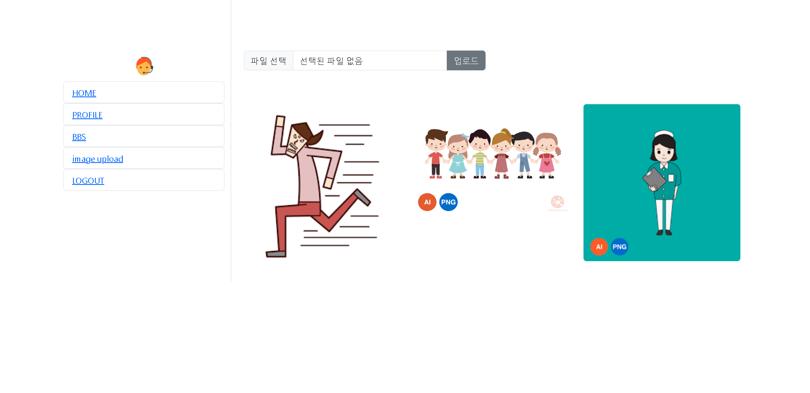

# 🌌 myspace project 🪐
### 🌍language🌎
- react
- firebase
- css3
- bootstrap
- javascript
  

### 💻 실행화면 💻
  
  
  
  

### 📋 설명 📋

react와 firebase를 이용해 만든 홈페이지입니다. 
회원가입을하면 이메일 인증을 할 수 있고, 박명록처럼 글을 게시하고, 수정, 삭제를 할 수 있습니다. 
이미지업로드도 가능합니다.

### 📌 코드링크 
- [KingYJJY 깃허브](https://github.com/kingyjjy/myhomepage "https://github.com/kingyjjy/myhomepage")
  

---