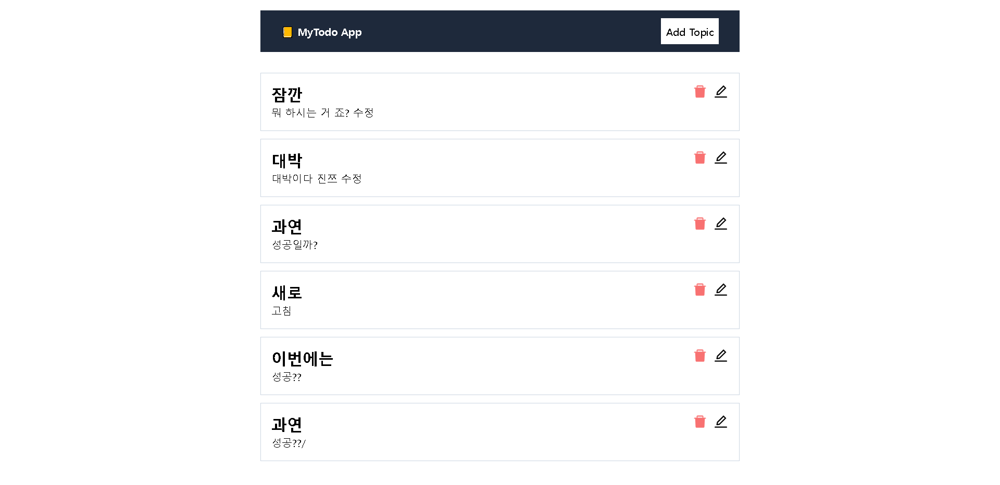
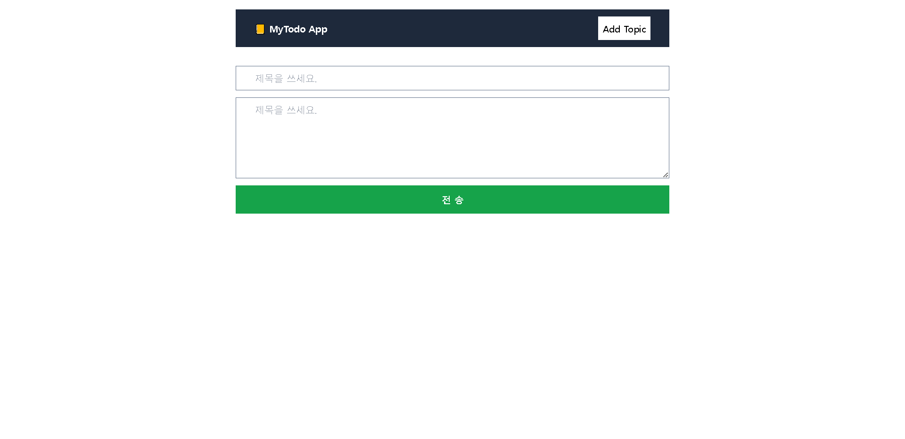
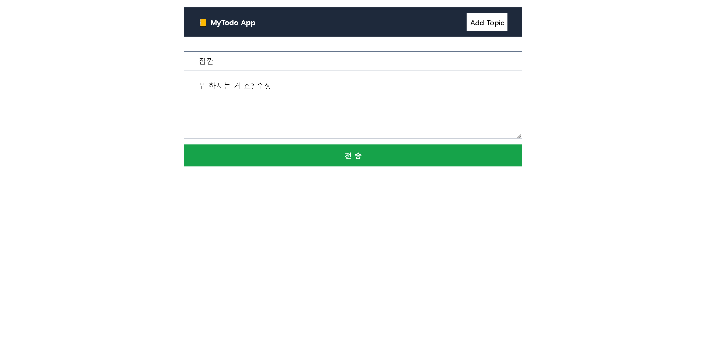

# 📒 todo list project 📝
### 🌍language🌎
- nextjs
- mongodb
- css3
- tailwind

  

### 💻 실행화면 💻
  
  
  
 

### 📋 설명 📋

nextjs와 mongodb를 이용해 만든 todolist입니다. 
mongodb를 이용해 crud가 가능합니다. 
디자인은 tailwind를 사용해 만들었습니다.

### 📌 코드링크 
- [KingYJJY 깃허브](https://github.com/kingyjjy/todo-web "https://github.com/kingyjjy/todo-web")
  

---